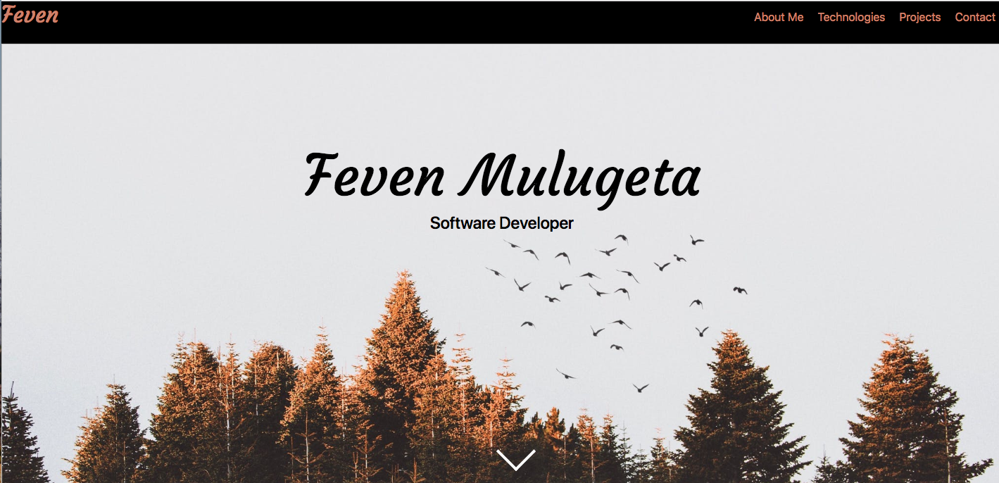
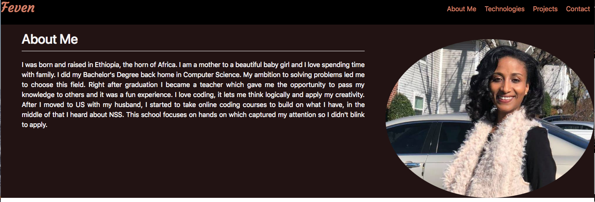
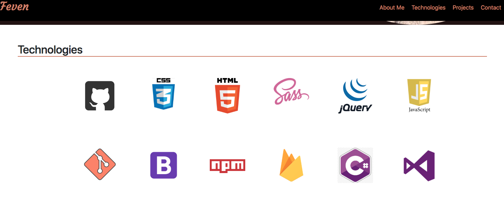
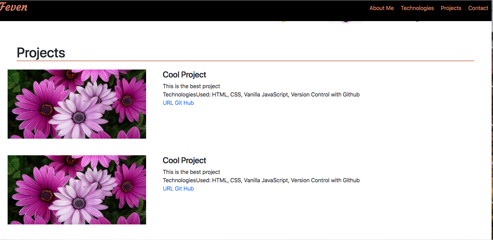
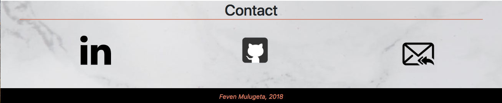

# Personal Bio Site
This is my personal site which contains the projects I have been working on. This site gave me a chance to practice more on CSS and firebase. 

## Screenshots

1. First Page

2. About Me

3. Technologies

4. Projects 

5. Contact 

## Technologies used 
* SASS
* Webpack
* Axios
* ES6 Modules

## How to run this project:

* To run this app you will need a firebase account and a new project.

1. Configure Firebase
* In the db folder rename apiKeys.json.example to apiKeys.json
* Add in the config object from your firebase project
2. Serve up the app
* At the root of the project: npm install
* npm start
## Contributor
* Feven Mulugeta

