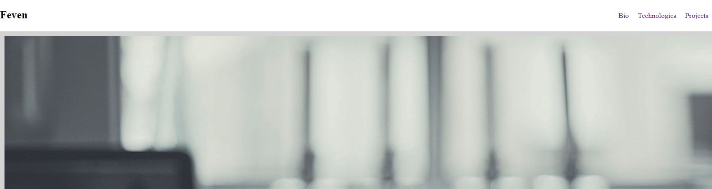

# Personal Bio Site
This is an individual project which we will be working on for the next 6 months.  
It is a personal site where I write some information about my selves and also list the technologies I have used so far.


## Screenshots




## How to run this project:

* Use nmp to install htpp-server:

```sh

npm install -g http-server

```
* Run the server:

```sh

hs -p 9999

```

* Open Chrome and navigate to:

```

localhost:9999

```
